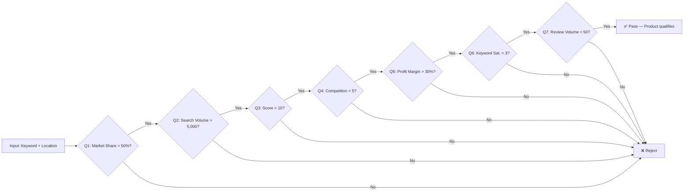

# Pattern First AI

> Turn conversations into executable patterns — not prompts.

[](#)
[](#)

Run a product research pattern with **one command**: no prompt engineering, no JSON wrangling.

```bash
node pattern-runner --keyword "Wireless Charging Pad" --location "US"
```

```text
Results — 5 of 10 products passed all 7 checks
✅ Smart Wireless Charging Pad     ★ Pass: 7/7
✅ Wireless Charging Pad Max       ★ Pass: 7/7
✅ Premium Wireless Charging Pad   ★ Pass: 7/7
...
📊 Constraint Report — Most restrictive: Q7 (Review Volume < 50)
```

---

## The 3-Step Workflow

```
[1] Input          [2] Pattern-First Engine      [3] Results
┌─────────────┐    ┌──────────────────────────┐  ┌──────────────────┐
│ keyword      │ →  │ 7 Falsifiability Checks  │ → │ Ranked products  │
│ location     │    │ (like a super-rigorous   │   │ that passed      │
│ (optional)   │    │  quality checklist)       │   │ all 7 checks    │
│ pattern file │    │                          │   │                  │
└─────────────┘    └──────────────────────────┘  └──────────────────┘
```

**You provide** a keyword and a market location.

**The engine runs** a structured checklist against simulated market data.

**You get** a ranked list of products that passed every check — plus a Constraint Report explaining what blocked the others and how to adjust.

---

## What Problem Does This Solve?

AI workflows today are dominated by:

* Bigger prompts
* Longer context windows
* More retries
* More loops
* More token consumption

This project explores an alternative: instead of optimizing *prompts*, we optimize **structure**.

Users express intent once. The system extracts objectives, constraints, invariants, and evaluation criteria — and compiles them into **reusable execution patterns**.

| Prompt Thinking | Pattern Thinking |
|---|---|
| "Write instructions for the AI" | "Extract structure from my intent" |
| "Give it context each time" | "Encode context once into the pattern" |
| "Retry if it goes wrong" | "Define what wrong means before running" |
| "The prompt is the product" | "The pattern is the product" |

---

## Core Idea

**Traditional flow:** text → LLM → output (no structure)

**Agent flow:** text → LLM → loop → evaluate → retry (still no structure)

**Pattern-first flow:**

```text
Human
↓
Formal Interview  ← capture intent, constraints, invariants once
↓
Pattern Compiler  ← normalize into reusable decision structure
↓
Pattern Runtime   ← execute with guarantees, not guesses
↓
Output
```

Patterns become **reusable assets**. You compile once, execute many times.

---

## How It Works: The Checklist

Think of it as a **super-rigorous quality checklist** for product research. Each product is scored against 7 falsifiability checks — pass all 7 and it's a viable opportunity.



| Check | Metric | What It Measures | Passing |
|---|---|---|---|
| Q1 | Market Share | Is there meaningful demand? | > 50% |
| Q2 | Search Volume | How many people search for it? | > 5,000 |
| Q3 | Score | How competitive is the space? | < 10 |
| Q4 | Competition Count | How many direct competitors? | < 5 |
| Q5 | Profit Margin | Can you make money? | > 30% |
| Q6 | Keyword Saturation | Are keywords already dominated? | < 3 |
| Q7 | Review Volume | Is the market saturated? | < 50 |

---

## Try It Now

### Prerequisites

- **Node.js >= 18** (`node --version`)
- Git

### Quick Start

```bash
git clone git@github.com:papajo/pattern-first.git
cd pattern-first

# Run product research
node pattern-runner --keyword "Yoga Mat" --location "US"

# Verbose mode — see every check for every product
node pattern-runner --keyword "Coffee Maker" --location "DE" --verbose

# Machine-readable JSON output
node pattern-runner --keyword "Smart Lighting" --location "US" --format json
```

### What You'll See

- ✅ **Passing products** — ranked, with all 7 metrics shown
- ❌ **Failed products** — each shows which check it failed and why
- 📊 **Constraint Report** — identifies the most restrictive criterion and suggests adjustments

### Need Help?

```bash
node pattern-runner --help
```

Pre-built example scripts are in the [`examples/`](examples/) directory.

---

## CLI Reference

```
pattern-runner --keyword <keyword> [options]

Required:
  --keyword, -k   Starting keyword for product research

Options:
  --location, -l  Geographic market (default: US)
  --pattern, -p   Pattern file (default: pattern-schema-test-results.json)
  --format, -f    Output format: table (default) | json
  --verbose, -v   Show per-check detail for every product
  --help, -h      Show help
  --list-patterns List available patterns
```

---

## Principles

### 1. Prompts are authoring interfaces
Prompts are temporary. Execution should run on structure.

### 2. State beats context
Persist decisions. Avoid retransmitting knowledge.

### 3. Constraints outperform instructions
Define boundaries. Allow execution freedom.

### 4. Compile once, execute repeatedly
Minimize repeated reasoning.

---

## Architecture

```text
patterns/          ← Reusable pattern definitions (versioned)
lib/               ← CLI engine (checks, formatter, seed data)
  checks.js        ← Falsifiability check runner
  seed-data.js     ← Deterministic mock data generator
  formatter.js     ← Output formatting (table, verbose, JSON)
examples/          ← Ready-to-run usage scripts
```

**Future layers** (see [todos-tasks.md](todos-tasks.md)):

```text
acquisition/   ← Interview → pattern
compiler/      ← interview.yaml → pattern.yaml
runtime/       ← Multi-phase executor with invariant enforcement
optimizer/     ← Benchmark, compress, evolve patterns
```

---

## Project Status

| Area | Status |
|---|---|
| Pattern schema | ✅ v0.1 defined |
| Interview method | ✅ Documented |
| CLI runner | ✅ Ready (`pattern-runner`) |
| MVP Research Pattern | ✅ Validated with 7 checks |
| User guide | ✅ Expanded with CLI reference |
| README (beginner workflow) | ✅ This version |
| Pattern library | 📅 Next |
| Compiler & Runtime | 📅 Planned |
| Real data integration | 📅 Planned |

See [todos-tasks.md](todos-tasks.md) for the full roadmap.

---

## Further Reading

- [User Guide](user-guide.md) — Detailed CLI reference, output formats, FAQ
- [Interview Method](interview-method.md) — How to capture intent as structure
- [Worked Example](worked-example.md) — Full lifecycle: prompt → interview → pattern → execution
- [Pattern Schema](pattern.schema.json) — The machine-readable contract
- [Todos & Roadmap](todos-tasks.md) — Current milestone and planned work

---

## Contributing

Do not submit prompts.

Submit patterns.
