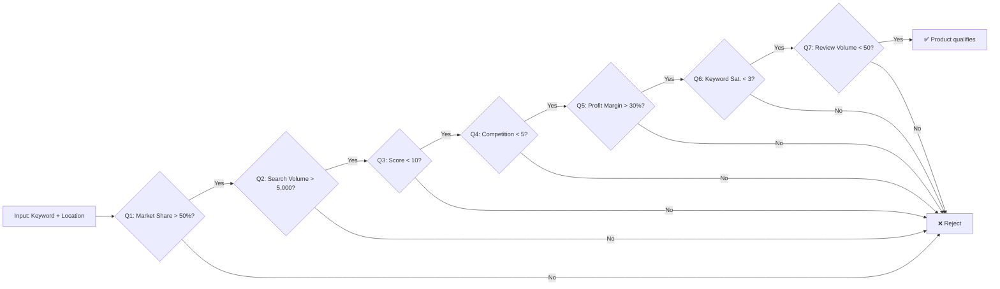

# Pattern First AI

> Turn conversations into executable patterns — not prompts.

[](#)
[](#)

---

## 🚀 Start Here: From Idea to Pattern

Most dev teams start with a thought, a Slack message, or a half-baked prompt. **That is exactly where every pattern in this repo began.**

This project gives you a method — not another prompt library — to turn that raw idea into a **reusable, executable pattern**:

```
Your idea or prompt
       ↓
  5-Act Interview  ← surfaces goal, checks, constraints, invariants
       ↓
  Compiled Pattern  ← machine-readable contract (committed to repo)
       ↓
  Runtime Execution  ← one command, deterministic results
       ↓
  Actionable Output  ← passing products + constraint report
```

➡️ **[See the full walkthrough →](docs/from-idea-to-pattern.md)**

Or jump straight in:

```bash
git clone git@github.com:papajo/pattern-first.git
cd pattern-first
node pattern-runner --keyword "Wireless Charging Pad" --location "US"
```

---

## Quick Demo

```text
$ node pattern-runner --keyword "Wireless Charging Pad" --location "US"

Pattern-First AI — Product Research Runner
────────────────────────────────────────────────────
Pattern:  ProductResearchMVP
Keyword:  Wireless Charging Pad
Location: US

Results — 5 of 10 products passed all 7 checks
────────────────────────────────────────────────────

✅ Products that PASSED
  Pro Wireless Charging Pad        ★ Pass: 7/7
  Wireless Charging Pad Max        ★ Pass: 7/7
  ...

❌ Products that FAILED
  Eco Wireless Charging Pad        Failed 4/7 checks
    First failure: Q1 (Market Share: 32% must be > 50%)

📊 Constraint Report
  Most restrictive: Q4 (Competition Count must be < 5)
  Failed: 8 product(s) | Average actual: 8.9
  💡 Consider decreasing the Competition Count threshold...
```

---

## The 3-Step Workflow

```
[1] You provide          [2] Pattern Engine            [3] You get
┌─────────────────┐    ┌──────────────────────────┐  ┌──────────────────────┐
│ keyword          │ →  │ 7 Falsifiability Checks  │ → │ Ranked products     │
│ location         │    │ (like a super-rigorous   │   │ that passed all 7   │
│ (optional)       │    │  quality checklist)       │   │ Constraint Report   │
│ pattern file     │    │                          │   │ on what blocked      │
└─────────────────┘    └──────────────────────────┘  └──────────────────────┘
```

---

## What Problem Does This Solve?

AI workflows today are dominated by bigger prompts, longer context windows, more retries, and more loops. This project flips the question from:

> "What prompt should I write?"

to:

> "What execution pattern should I compile?"

| Prompt Thinking | Pattern Thinking |
|---|---|
| "Write instructions for the AI" | "Extract structure from my intent" |
| "Give it context each time" | "Encode context once into the pattern" |
| "Retry if it goes wrong" | "Define what wrong means before running" |
| "The prompt is the product" | "The pattern is the product" |

**Compile once. Execute many times.**

---

## How It Works: The 7-Check Flowchart



| Check | Metric | Pass Condition |
|---|---|---|
| Q1 | Market Share | > 50% |
| Q2 | Search Volume | > 5,000 |
| Q3 | Score | < 10 |
| Q4 | Competition Count | < 5 |
| Q5 | Profit Margin | > 30% |
| Q6 | Keyword Saturation | < 3 |
| Q7 | Review Volume | < 50 |

---

## Try It Now

### Prerequisites

- **Node.js >= 18** (`node --version`)
- Git

### Quick Start

```bash
git clone git@github.com:papajo/pattern-first.git
cd pattern-first

# Run product research
node pattern-runner --keyword "Yoga Mat" --location "US"

# Verbose mode — see every check for every product
node pattern-runner --keyword "Coffee Maker" --location "DE" --verbose

# Machine-readable JSON output
node pattern-runner --keyword "Smart Lighting" --location "US" --format json
```

### What You'll See

- ✅ **Passing products** — ranked, with all 7 metrics shown
- ❌ **Failed products** — each shows which check it failed and why
- 📊 **Constraint Report** — identifies the most restrictive criterion and suggests adjustments

### Need Help?

```bash
node pattern-runner --help
```

Pre-built example scripts are in the [`examples/`](examples/) directory.

---

## CLI Reference

```
pattern-runner --keyword <keyword> [options]

Required:
  --keyword, -k   Starting keyword for product research

Options:
  --location, -l  Geographic market (default: US)
  --pattern, -p   Pattern file (default: pattern-schema-test-results.json)
  --format, -f    Output format: table (default) | json
  --verbose, -v   Show per-check detail for every product
  --help, -h      Show help
  --list-patterns List available patterns
```

---

## Principles

1. **Prompts are authoring interfaces** — Execution should run on structure, not text.
2. **State beats context** — Persist decisions. Avoid retransmitting knowledge.
3. **Constraints outperform instructions** — Define boundaries. Allow execution freedom.
4. **Compile once, execute repeatedly** — Minimize repeated reasoning.

---

## Project Status

| Area | Status |
|---|---|
| CLI runner | ✅ Ready (`pattern-runner`) |
| MVP Research Pattern | ✅ Validated with 7 checks |
| From idea to pattern walkthrough | ✅ [New guide](docs/from-idea-to-pattern.md) |
| Pattern schema | ✅ v0.1 defined |
| Interview method | ✅ [Documented](interview-method.md) |
| Worked example | ✅ [Full lifecycle](worked-example.md) |
| User guide | ✅ [CLI reference](user-guide.md) |
| Pattern library | 📅 Next |
| Compiler & Runtime | 📅 Planned |
| Real data integration | 📅 Planned |

See [todos-tasks.md](todos-tasks.md) for the full roadmap.

---

## Further Reading

- **[From Idea to Pattern](docs/from-idea-to-pattern.md)** — Step-by-step walkthrough of the full pipeline
- **[User Guide](user-guide.md)** — CLI reference, output formats, FAQ
- **[Interview Method](interview-method.md)** — How to capture intent as structure
- **[Worked Example](worked-example.md)** — Full lifecycle: prompt → interview → pattern → execution
- **[Pattern Schema](pattern.schema.json)** — The machine-readable contract
- **[Backlog & Roadmap](todos-tasks.md)** — Current milestone and planned work

---

## Contributing

Do not submit prompts.

Submit patterns.
